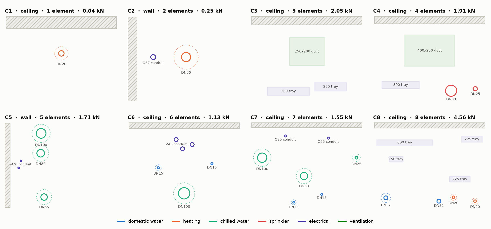

# CrossMEP

[](https://github.com/lavinia-ped/CrossMEP_Dataset/actions/workflows/ci.yml)
Data: CC BY 4.0 · Code: MIT · Python ≥ 3.9 · generator needs only NumPy; the JSON files need nothing.

A tiered synthetic dataset of multi-trade MEP cross-sections for learning-based
structural support assembly (SSA) synthesis.

**In practitioner terms.** Pick one hanger location on a coordinated corridor
run and cut the section. What the support designer receives is exactly that
section: which services pass (pipes by DN and service, cable trays, ducts,
conduit groups), their bare size and insulation, what each weighs per metre and
at the support spacing it was sized for, how far apart they are, how they stack,
and what they hang from (slab or wall, substrate, thickness). CrossMEP is that
section in numbers — 7,000 of them — with the spacing drawn from measurements on
a built project and checked on sections of two open buildings, and **nothing
about the support itself**: no
channel, rods, clamps or anchors, because that is the answer the dataset exists
to let a method find.

Paper: *CrossMEP: A Tiered Synthetic Dataset of Multi-Trade MEP Cross-Sections*,
Pedrollo, Gvadzabia, Graeber & Fischer, 43rd CIB W78 Conference, 2026.
Companion formulation: Pedrollo, Graeber & Fischer, ISARC 2026.



*One context per difficulty tier from the benchmark split: tier Cn holds exactly n
elements; ceilings and walls; dashed rings are insulation.*

## Files

| revision | file | contexts | elements | seed | purpose |
|---|---|---|---|---|---|
| 4.0 | `data/v4.0/mep_contexts_v4.0_train.json` | 5,000 | 22,500 | 1000 | training (625 per tier) |
| 4.0 | `data/v4.0/mep_contexts_v4.0_val.json` | 500 | 2,242 | 2000 | validation |
| 4.0 | `data/v4.0/mep_contexts_v4.0_test.json` | 500 | 2,242 | 3000 | held-out test |
| 4.0 | `data/v4.0/mep_contexts_v4.0_benchmark.json` | 1,000 | 4,500 | 42 | stratified benchmark (125 per tier) |
| 3.0 | `data/v3.0/mep_contexts_v3.0_*.json` | same | same | same | the paper release (frozen) |

Tiers are assigned round-robin C1…C8 within each split; seeds are disjoint; the
two revisions contain the same elements in the same rows. SHA-256 digests of all
eight files are in `RELEASE_CHECKSUMS.txt`. `mep_contexts_gallery.html` is an
interactive gallery of the 4.0 benchmark (filter by tier / kind / trade /
surface; `data/v3.0/` holds the 3.0 one); `schema/` the JSON Schemas;
`croissant.json` the ML-metadata card; `DATASHEET.md` the datasheet (Gebru et
al., 2021); `VERIFICATION_LOG.md` the audit of every constant; `RESULTS.md` the
numbers this release produces; `CHANGELOG.md` the version lineage.

## Schema at a glance

Per element: `kind` (pipe | cable_tray | duct | conduit), `service`, `trade`,
`shape` (round | rect), `label`, bare `width_mm` × `height_mm`
(building-horizontal × vertical), `insulation_mm` (per side), `load_kN` (per
support point), `span_m` (the support spacing that load was derived at) and
`load_kN_per_m` (so `load_kN = load_kN_per_m × span_m`), `level` (generative row
index — metadata, not a physical invariant), `along_mm` (offset along the
surface, rows centred on 0) and `out_mm` (standoff out from the surface, positive
away). Per context: `tier`, `surface` {kind ceiling | wall, substrate,
thickness_mm}, `n_elements`, `n_levels`, `total_load_kN`, `bundle_width_mm`.
Units: mm, kN, m. On a wall the section rotates: the extent *along* the surface
is the element's height. Revision 3.0 files carry the same fields without
`span_m` / `load_kN_per_m`.

## Install

```bash
pip install -e ".[test]"          # generator + tests (NumPy, pytest, jsonschema, SciPy)
# or just: pip install numpy
```

Consuming the JSON files needs only the standard library:

```python
import json
data = json.load(open("data/v4.0/mep_contexts_v4.0_benchmark.json"))
ctx = data["contexts"][0]
print(ctx["tier"], ctx["surface"]["kind"], len(ctx["elements"]))
```

```python
import crossmep.tasks as cm                       # stdlib only
data = cm.load("benchmark")                       # revision 4.0; cm.load("benchmark", "3.0") for the paper files
print(cm.per_tier_table(data))                    # medians per tier (RESULTS.md)
cm.filter_contexts(data, pipes=2, trays=1)        # exactly 2 pipes + 1 tray
cm.filter_contexts(data, ducts=(1, None))         # at least one duct
cm.catalog_coverage(data, [(48, 54, 2.5), (108, 114, 4.0)])  # share of pipes a clamp catalog can attach
cm.min_clear_gap(ctx)                             # minimum pairwise physical clear gap (= congestion_score)
cm.validate(ctx)                                  # full validator on a dict
```

Scoring a method (stdlib only): one outcome per context — feasible or not, or a
cost — gives per-tier results with 95 % intervals, the tier-balanced mean, an
optional mean weighted to a building's mix, and paired tests between methods.

```python
from crossmep.evaluate import score, compare, render
s = score(my_results, data)                       # {context_id: True/False or a number}
print(render(s))
compare(my_results, baseline_results, data)       # paired bootstrap + exact McNemar
```

```bash
python -m crossmep evaluate my_results.json --against baseline.json --threshold 0.5
```

## Reproduce the release

```bash
python -m crossmep generate --split benchmark --out benchmark.json      # revision 4.0
python -m crossmep generate --split benchmark --version 3.0 --out b3.json
sha256sum benchmark.json b3.json; cat RELEASE_CHECKSUMS.txt           # identical digests
python -m crossmep validate                       # validator + JSON Schema over all eight files
python -m crossmep results                        # per-tier tables, kinds, catalog coverage
python verify/compare_gaps.py                     # section 5.2 as published (June 2026 duplex samples)
python verify/compare_sections.py --sensitivity   # section 5.2 on sections of two open buildings, with intervals
python verify/tier_trends.py                      # section 5.1 with intervals and a population estimate
python verify/catalog_stress.py                   # section 5.3: error bars, sensitivity, demand curve
python -m pytest                                  # everything above as tests
```

Every CI run regenerates all eight files and compares digests on Python 3.9–3.13
and NumPy 1.26 / 2.0 / latest, so a change in NumPy's `Generator` stream, in
the element library, or in the layout engine fails the build. Three details are
worth knowing if you fork the generator:

* `total_load_kN` is `round(math.fsum(loads), 2)`. Python 3.12 switched `sum()`
  to compensated summation; with plain `sum()` 28 of the 7,000 released values
  flip at a `.xx5` boundary on Python ≤ 3.11. `fsum` is exactly rounded on every
  version.
* Files are compact JSON (`json.dumps(payload)`), ASCII-escaped, no trailing newline.
* The order of every random draw is part of the data format; the two revisions
  differ only in layout arithmetic, never in a draw, and two historical quirks
  are preserved and marked `# stream:` in `crossmep/generate.py`.

## Difficulty tiers (count-stratified)

Tier **Cn** contains exactly *n* elements (C1…C8); composition — kinds, trades,
services, surfaces, stacking — is marginalised within each tier so that element
count is the single controlled difficulty axis. C1 covers every kind (a lone
pipe of any service, a single tray, duct or conduit). Benchmark split, revision
4.0, medians:

| tier | min. clear gap (mm) | total load (kN) | bundle width (mm) |
|---|---|---|---|
| C1 | — | 0.10 | 102 |
| C2 | 120 | 0.23 | 344 |
| C3 | 98 | 0.44 | 613 |
| C4 | 90 | 0.55 | 728 |
| C5 | 73 | 0.78 | 1027 |
| C6 | 76 | 1.21 | 993 |
| C7 | 60 | 1.49 | 1138 |
| C8 | 62 | 1.71 | 1448 |

The clear gap is the physical gap between insulation surfaces; these are the
values of the paper's §5.1 (120 → 61 mm). With 2,000 freshly generated contexts
per tier (`verify/tier_trends.py`), load rises at every tier (Spearman ρ with the
tier +0.56 on the benchmark); the clear gap shrinks overall (-0.36) but widens
again at C6, and the bundle width dips there, because from six elements the
generator stacks in two or three rows (median elements per row 5 at C5, 3 at C6).
That is a property of the generator, not sampling noise; the C7/C8 swap of the
benchmark gap medians is noise. The tier controls the element count; difficulty
here means scene complexity, not solver hardness. Full tables,
the Table-1-style ranges on the train split and the 3.0 values are in
`RESULTS.md`.

## Generate

```bash
python -m crossmep generate --n 320 --seed 7                      # round-robin C1..C8
python -m crossmep generate --n 200 --seed 7 --tier C5            # one tier
python -m crossmep generate --n 100 --pipes 3 --trays 1 --gallery my.html   # custom composition
```

```python
from crossmep import generate_dataset, generate_custom, validate_context
ctxs = generate_dataset(1000, seed=42)                       # == the 4.0 benchmark split
generate_dataset(1000, seed=42, revision="3.0")              # == the paper's benchmark
generate_custom(100, pipes=3, trays=1)                       # exact composition
generate_custom(50, pipes=(2, 4), conduits=(2, 6), surface="ceiling")
generate_custom(20, pipes=2, trades=["chilled"], seed=7)
```

Custom scenes reuse the verified element library and the same layout rules
(fitted gaps, 25 mm clearance floor, calibrated stagger, wall drip rule), so
they are construction-valid by the same rules; they are tagged `tier: "custom"`
because realism *verification* attaches to the natural distribution. The
canonical splits stay frozen: comparable numbers always come from seed 42. The
v3.x entry points `mep_context_sampler.py` and `crossmep_tasks.py` still work
and forward to the package.

## What is encoded, and where it comes from

Every number has a source and a status (`VERIFICATION_LOG.md`), and every
per-support load is *computed* in `crossmep/library.py` from those sources:

* **Pipes** — EN 10220 / EN 10255 medium-series carbon steel, DN15–100, water
  filled; support spans from ASME B31.1 Table 121.5 water-service points under a
  floor rule (no interpolation); insulation per GEG Anlage 8 (heated lines) and
  a 30/50 mm condensation-control schedule (chilled); grouped as trades run
  (domestic hot + cold pairs, heating flow + return, chilled banks, a sprinkler
  main with an optional branch).
* **Cable trays** — IEC 61537 systems, 150–600 mm wide, loaded on a
  design-for-full basis from the published 50 kg/m full-300-mm-tray datum.
* **Ducts** — EN 1505 preferred rectangular sizes with verbatim manufacturer
  duct-weight cells (flange and bracing included); EN 1506 round spiral sizes.
* **Conduits** — IEC 61386-1 metric sizes in parallel groups of 2–6, steel
  tube plus IEC 40 %-of-bore cable fill.
* **Layout** — bulky services nearest the slab (ducts, then trays and conduits,
  then pipes); clear gaps from a lognormal fitted to gaps measured on the open
  Duplex Apartment MEP model above the 25 mm pipe-rack minimum; half-normal
  within-row stagger calibrated to the measured in-bundle elevation spread; on
  walls, electrical containment kept above wet services.

What is *not* encoded is stated as plainly: duct insulation (no verified
thickness source), gravity drainage (slope cannot be represented in one
section), anchor capacity, and anything about the support. Trade mix, surface
split and size bands are design parameters, not survey results.

## Validation and verification

Every context — released, regenerated or custom — passes `validate_context`:
field domains; pairwise clearance (the insulation surfaces of any two elements
are at least 25 mm apart *along* the surface **or** *out* from it); per-row
centring. Violations raise `ContextValidationError` (not `assert`, so they
survive `python -O`). The validator is physical and is applied to both
revisions.

The verification chain is executable end to end:

1. **Constants.** Loads derive from sourced primitives (EN 10255 wall thickness
   × 7,850 kg/m³ + water fill × B31.1 spans; the tray datum; Walraven cells; IEC
   fill). Tests pin the derived values to the frozen release tables and check
   every element in the released files against the library, including the
   recorded `span_m` and `load_kN_per_m`.
2. **Spacing vs. open buildings.** `verify/measure_ifc.py` cuts IFC models into
   sections every 250 mm, as a context is defined, and measures the clear gap
   between side-by-side runs (bare surfaces); `verify/compare_sections.py`
   compares the generated pipe gaps with them, with bootstrap intervals and the
   noise floor of each sample. Models: buildingSMART Duplex Apartment (MEP,
   Plumbing) and Medical-Dental Clinic (Plumbing; a real building), CC BY 4.0;
   derived records and attribution in `verify/measured/`. Wasserstein-1, mm, pairs
   weighted by shared length:

   | | Clinic | Duplex MEP | Duplex Plumbing |
   |---|---|---|---|
   | generated (benchmark, 4.0) | **28** (16–44) | 70 (57–99) | 85 (59–132) |
   | Clinic | — | 71 | 85 |
   | Duplex MEP | | — | 26 |

   The generator is as close to the clinic (797 pipe pairs), which it was not
   fitted to, as the duplex's two models are to each other, and as far from the
   small duplex (74 and 41 pairs) as the clinic is; a fixed 25 mm gap is 189 mm
   away. The result holds across 11 settings of the cut (27–36 mm). The
   gap lognormal itself (n = 73, μ = 5.018, σ = 0.848, KS p = 0.53) was fitted to
   gaps measured on the duplex in June 2026; `verify/compare_gaps.py` reproduces
   the paper's §5.2 numbers from those shipped samples, which the documented
   June procedure does not regenerate (`verify/VERIFICATION.md`).
3. **Conventions.** Tiering order, service banking, insulation schedules and
   the wall drip rule (0 violations in 2,913 wet/electrical pairs on the
   benchmark) are tested over hundreds of unseen seeds.
4. **Catalog stress test (paper §5.3).** `crossmep/catalog.py` states precisely
   what "a clamp catalog attaches this element" means, and
   `verify/catalog_stress.py` answers it with error bars instead of one number.
   For the paper's two-size catalog (48–54 mm up to 2.5 kN; 108–114 mm up to
   4.0 kN) on the benchmark:

   | | |
   |---|---|
   | attachable pipes | 293 of 2,529 = **11.6 %** (95 % CI 10.1–13.0; cluster bootstrap over contexts) |
   | population estimate | 10.8 % (10.5–11.2) from 16,000 generated contexts; per tier 10.4–11.4 % |
   | sizes attached | DN40 only; DN100 (114.3 mm) lies 0.3 mm above the 108–114 mm bin |
   | why the rest is missed | no size fits 2,236 pipes; none too heavy (0.88 kN vs 2.5 kN); 1,971 trays, ducts and conduits |
   | sensitivity | 12.9 % with bins widened by 0.5 mm; 16.4 % with the bare diameter on every line |
   | what any catalog needs | two well-placed 6 mm sizes would attach 43.0 %, six 80.1 %, twelve all |

   Only size and capacity are tested, so coverage is an upper bound on what can
   be installed. Try your own catalog: `python verify/catalog_stress.py --bins
   40:60:2.0,100:120:3.0`.

## Generator Studio

`docs/studio/index.html` is an interactive page for demonstrating the generator:
choose a tier or an exact mix of services, the surface and a seed, and press
*Generate another*. Each section is drawn as an A4 support detail the way an
engineer would issue it (section A–A at a standard scale, 1:1 to 1:100; hatched
slab or wall broken off where it continues; each service at true size with its
insulation and centrelines; one callout per service with its size and trade,
level below the soffit or offset from the wall, and load at the support; the
overall dimension and the closest clear gap; notes and a title block) beside a
3D model of 2.4 m of the run (three.js). *Enlarge* gives the sheet the full
width. The element schedule, the Python call that reproduces the section, the
generator's rules and the spacing drawn in the run sit under *Details*. It embeds
real outputs of the released generator (tiers C1–C8 × seeds 0–9, 12 sections
each; 247 compositions × ceiling / wall × seeds 0–2, 4 sections each);
`python scripts/build_studio.py` rebuilds it, and `tests/test_studio.py` checks
the embedded sections against fresh generator runs. Open the file in a browser;
it needs no server.

## Presenting the dataset

`docs/CrossMEP_CIBW78_talk.pptx` (and its PDF) is a ten-minute talk on the
dataset: 15 slides, one of them a live demo of the Generator Studio with its
screenshot as the fallback, plus five appendix slides, with speaker notes on
every slide; `docs/TALK.md` is the same talk as a script with the questions
practitioners ask; `docs/figures/` holds the figures. Everything regenerates from
the released data: `python scripts/make_figures.py` (`pip install matplotlib
"qrcode[pil]"`) writes the figures and the numbers the deck prints,
`scripts/screenshot_gallery.js` and `scripts/screenshot_studio.js` (Playwright)
capture the gallery and the studio, and `node docs/deck/build_deck.js` (`npm install
pptxgenjs react-icons react react-dom sharp jszip`) builds the deck;
`docs/deck/preview.py` renders a trace of the build for layout checks where
LibreOffice is unavailable.

## Repository layout

```
crossmep/            package: model · library · layout · generate · io · tasks · catalog · evaluate · render · cli
data/v4.0/           current data revision (four splits)
data/v3.0/           the paper release (four splits + its gallery), frozen
schema/              JSON Schemas (draft 2020-12) for revisions 3.x and 4.x
verify/              IFC section-cut measurement, measured records of two open buildings,
                     distribution comparisons, tier trends, catalog stress test
scripts/             figures, gallery and studio screenshots for the talk; the studio build
docs/                talk script, slide deck, figures, Generator Studio (docs/studio/)
tests/               196 checks: derivations, geometry, generation over seeds, byte-exact
                     regeneration of both revisions, schema, paper numbers, metrics, the catalog
                     stress test, the section-cut measurement (recomputed from the shipped
                     segment tables), interval formulas and the evaluation harness, the studio data, CLI, shims
```

## Versions and relation to the paper

**Data revisions.** `data/v4.0/` (current) and `data/v3.0/` (the files the CIB
W78 2026 paper was released with) contain the same elements, loads, rows and
standoffs. In 3.0 every element also carried a 25 mm routing envelope on each
side, so neighbours sat 50 mm further apart than the sampled gap and
`bundle_width_mm` included that envelope; 4.0 makes the sampled,
measurement-fitted gap the physical clear gap between insulation surfaces and
records `span_m` and `load_kN_per_m` per element. The spacing results of the
paper (the §5.1 clearance medians, 120 → 61 mm, and the §5.2 distance of 41 mm)
are those of the sampled gap and hold for the 4.0 geometry; `python
verify/compare_gaps.py --version 3.0` reports the 3.0 files. On sections of the
held-out clinic, the 4.0 geometry is 28 mm from the measured pipe gaps and the
3.0 geometry 65 mm (`verify/compare_sections.py`, `tests/test_sections.py`). Both revisions
regenerate byte-for-byte from the generator (`--version 3.0 | 4.0`).

**Element library.** The paper also describes an extended pipe library (function
× material, including copper, stainless and plastic pipe up to 125 mm) and
further substrates. The public element library covers carbon-steel pipe
DN15–100 on concrete slabs and walls. The layout engine is the same, so the
split sizes and the spacing results reproduce from these files, while
composition-dependent values differ slightly (benchmark: 2,529 pipes / 1,141
conduits / 569 trays / 261 ducts; catalog coverage 11.6 % overall (95 % CI
10.1–13.0), 9.2–13.6 % by 125-context tier). `RESULTS.md` gives every value for the public files; the tests pin them.

**Modelling simplifications.** Stagger is drawn per element, so two pipes of one
bank can sit at different standoffs, whereas a bank on a shared trapeze would be
co-planar; row spacing is a fixed 120 mm clear plus stagger rather than a
trapeze depth. Both are listed in `DATASHEET.md`.

## License

Data: CC BY 4.0 (`LICENSE-DATA`). Code: MIT (`LICENSE-CODE`). The dataset is
synthetic, contains no personal or project-identifying information, and **must
not be used for the structural design of real installations**.

## Citation

See `CITATION.cff`. Please cite the dataset paper (CIB W78 2026) and the
companion formulation paper (ISARC 2026).
